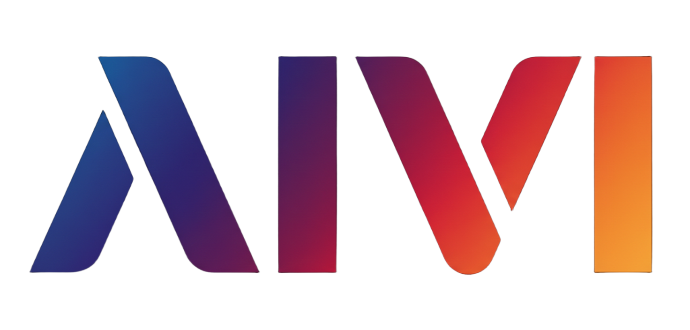

# AIVI

> [!CAUTION]
> This is a vibe coded project. Do not use for anything serious. I'm still rewriting a lot of fundamentals.

<p align="center">
  
</p>

**AIVI** is a purely functional language that compiles to native binaries via Rust/Cranelift. It's designed for developers who want strong static types, explicit effects, and a first-class GTK4 UI story — without writing C, C++, or Rust as their day-to-day language.

---

## Why now?

The open desktop is having a moment. Governments, enterprises, and individuals across Europe are actively looking to reduce dependency on proprietary American platforms. Linux is growing. GNOME is maturing. GTK4 is a genuinely excellent toolkit — but building apps on top of it in C or even Rust requires significant boilerplate, manual memory management discipline, and a steep learning curve.

**AIVI wants to fix that.** It sits at the sweet spot between "high-level enough to move fast" and "low-level enough to ship a real native app":

- 🦀 **Rust-powered runtime** — no GC pauses, no Electron bloat, no 200 MB runtime. Your app links against GTK4 directly.
- 🧠 **Purely functional** — immutable by default, exhaustive pattern matching, no nulls, typed errors. The compiler catches whole classes of bugs before they ship.
- 🖥️ **GTK4 as a first-class citizen** — a dedicated XML sigil, typed signal streams, and a declarative model/update loop make UI code feel like it belongs in the language.
- ⚡ **Developer experience that doesn't quit** — a built-in LSP with autocomplete, hover, diagnostics, and formatting. A VS Code extension. A formatter. An MCP server for AI-assisted workflows.

---

## A taste of the language

AIVI is expression-oriented with a clean, minimal syntax. Bindings are immutable, functions are curried, and effects are tracked in the type system.

```aivi
module user.myapp

use aivi
use aivi.net.http

// Types are structural records and ADTs
User = { id: Int, name: Text, email: Option Text }

ApiError = NotFound | Timeout | ParseError Text

// Functions look like math
greet : User -> Text
greet = user => "Hello, { user.name }!"

// Effects are explicit: Effect ErrorType SuccessType
fetchUser : Int -> Effect ApiError User
fetchUser = id => do Effect {
  resp <- http.get (~u(https://api.example.com/users/{ id }))
  resp.body |> json.decode or
    | ParseError msg => fail (ParseError msg)
}

// Pattern matching is exhaustive — the compiler rejects non-exhaustive cases
describe : ApiError -> Text
describe =
  | NotFound      => "user not found"
  | Timeout       => "request timed out"
  | ParseError m  => "bad response: { m }"
```

No null checks. No forgotten error branches. The compiler makes the happy path and every failure mode equally visible.

---

## GTK4 native apps — without the ceremony

This is where AIVI really shines. The `~<gtk>...</gtk>` sigil lets you write GTK4 UI trees inline, with full type checking, signal wiring, and dynamic child lists.

### Declarative UI with the GTK sigil

```aivi
module user.notepad

use aivi
use aivi.ui.gtk4

// Messages your app can receive
Msg = Save | TitleChanged Text | BodyChanged Text

// UI tree — looks like XML, compiles to typed GtkNode values
editorNode : GtkNode
editorNode =
  ~<gtk>
    <GtkBox orientation="vertical" spacing="8" marginTop="16">
      <GtkEntry id="titleInput" onInput={ Msg.TitleChanged }
        placeholder-text="Note title" />
      <GtkEntry id="bodyInput" onInput={ Msg.BodyChanged }
        placeholder-text="Write something..." />
      <GtkButton label="Save" onClick={ Msg.Save } />
    </GtkBox>
  </gtk>
```

No callback spaghetti. Signal handlers are typed ADT constructors — the compiler rejects anything that isn't a valid `Msg`.

### Event loop with `signalStream`

Events arrive through a typed channel. You dispatch them in a tail-recursive loop — purely functional, no mutable state:

```aivi
State = { title: Text, body: Text }

runLoop : AppWindow -> State -> Recv GtkSignalEvent -> Effect GtkError Unit
runLoop = win => state => rx => do Effect {
  result <- channel.recv rx
  result match
    | Err _ => pure Unit    // channel closed, app is shutting down
    | Ok event =>
        event match
          | GtkInputChanged wid txt when wid == titleInputId =>
              runLoop win (state <| { title: txt }) rx
          | GtkInputChanged wid txt when wid == bodyInputId =>
              runLoop win (state <| { body: txt }) rx
          | GtkClicked _ =>
              do Effect {
                _ <- saveNote state
                runLoop win state rx
              }
          | _ => runLoop win state rx
}

main : Effect GtkError Unit
main = do Effect {
  init Unit
  appId <- appNew "com.example.notepad"
  win   <- windowNew appId "Notepad" 640 480
  root  <- buildFromNode editorNode
  windowSetChild win root
  rx    <- signalStream {}
  windowPresent win
  _ <- appRun appId
  runLoop win { title: "", body: "" } rx
}
```

### Dynamic lists with `<each>`

```aivi
renderTodos : List Text -> GtkNode
renderTodos = items =>
  ~<gtk>
    <GtkBox orientation="vertical" spacing="4">
      <each items={items} as={item}>
        <GtkLabel label={ item } xalign="0" />
      </each>
    </GtkBox>
  </gtk>
```

One list value, one `<each>` — no manual widget creation loops, no index tracking.

---

## Structural record patching

State updates read like plain data declarations, not mutating assignments. The `<|` operator applies a type-checked patch:

```aivi
// Update a single field
newState = state <| { title: "New Title" }

// Update a nested field
newState = state <| { user.profile.avatar: "new.png" }

// Transform all items in a list
discounted = cart <| { items[*].price: _ * 0.9 }  // 10% off

// Target by predicate
flagged = cart <| { items[price > 80].tag: "premium" }
```

The compiler verifies every path exists and every value matches the expected type.

---

## Domains: units baked into the type system

AIVI's domain system lets you give meaning to numeric literals and operators at the type level. Common suffixes from the standard library just work:

```aivi
use aivi.chronos.duration (domain Duration)
use aivi.color (domain Color)

// Typed duration literals — not raw numbers
timeout  = 30s
debounce = 200ms
animDur  = 0.3s

// Color math with perceptual adjustments
hoverColor = brand + 10% lightness   // brighter variant
mutedColor = brand - 30% saturation  // desaturated variant
```

You can define your own domains to give operators meaning in your problem space — pixel coordinates, monetary values, physical units, anything.

---

## The standard library

The stdlib covers the typical surface you need to ship a real app. A few highlights:

| Area | Modules |
|:-----|:--------|
| **Collections** | `list`, `map`, `set`, `queue`, `heap` |
| **Text** | `text`, `regex`, `i18n` |
| **Time** | `chronos.instant`, `chronos.duration`, `chronos.calendar`, `chronos.timezone` |
| **Math** | `math`, `vector`, `matrix`, `geometry`, `probability`, `signal`, `linearAlgebra` |
| **I/O** | `file`, `console`, `database`, `database.pool`, `path`, `url` |
| **Network** | `net.http`, `net.https`, `net.httpServer`, `net.rest`, `net.sockets` |
| **Concurrency** | `concurrency` (scoped tasks, typed channels, `Send`/`Recv`) |
| **System** | `system`, `crypto`, `secrets`, `log` |
| **UI** | `ui.gtk4`, `ui.color`, `ui.layout`, `ui.html`, `ui.vdom` |

The `aivi.concurrency` module gives you scoped tasks and typed channels — real async concurrency modelled as values, without shared mutable state.

---

## Effects and resources

Effects are part of the type. You can't accidentally call an effectful function in a pure context, and error types are tracked like any other:

```aivi
// Resource cleanup is automatic and guaranteed
withDatabase : Effect DbError Unit
withDatabase = do Effect {
  conn <- managedConnection "postgres://localhost/myapp"
  rows <- db.query conn "SELECT id, name FROM users"
  rows |> list.forEach (row => print "{ row.id }: { row.name }")
}  // conn released here, even on error

// Precondition guards read like prose
withdraw : Float -> Account -> Effect BankError Account
withdraw = amount => account => do Effect {
  given amount > 0                    or fail (InvalidAmount amount)
  given account.balance >= amount     or fail InsufficientFunds
  pure (account <| { balance: account.balance - amount })
}
```

---

## Tooling

- **LSP server** (`aivi-lsp`) — autocomplete, hover with inline docs, go-to-definition, rename, real-time diagnostics, semantic highlighting
- **Formatter** — `aivi fmt` formats any `.aivi` file to canonical style; also available as a format-on-save action in the VS Code extension
- **VS Code extension** — bundles the LSP, grammar highlighting, and formatting in one install
- **Zed extension** — grammar and LSP support for Zed
- **MCP server** — `aivi mcp serve` exposes the language specs as MCP resources for AI-assisted development workflows

---

## Getting started

You need Rust installed. Then:

```bash
cargo install --path crates/aivi

aivi --help
```

From there:

```bash
# Run a file
aivi run myapp.aivi

# Format code
aivi fmt myapp.aivi

# Start the language server (for editors)
aivi-lsp

# Explore the language specs
ls specs/
```

The `specs/` folder is a VitePress site — run `pnpm docs:dev` inside it to browse the full language and stdlib documentation locally.

---

## The bigger picture

Electron gave us cross-platform apps at the cost of hundreds of megabytes of runtime and noticeable input lag. Native toolkits give us performance but ask you to write C. AIVI believes there's a better path: **a high-level, safe, functional language that targets the native Linux desktop directly.**

GTK4 and GNOME have never been better. The Linux desktop ecosystem is getting real investment. And there's a growing appetite — especially in Europe — for software infrastructure that isn't controlled by a handful of American platform vendors.

AIVI wants to be the language that makes building that software a pleasure.

---

## Status

Early but active. The core language, typechecker, formatter, and LSP are functional. GTK4 bindings are being expanded. The Cranelift JIT/AOT backend is in progress. Expect breaking changes.

Contributions, feedback, and bug reports are welcome.
