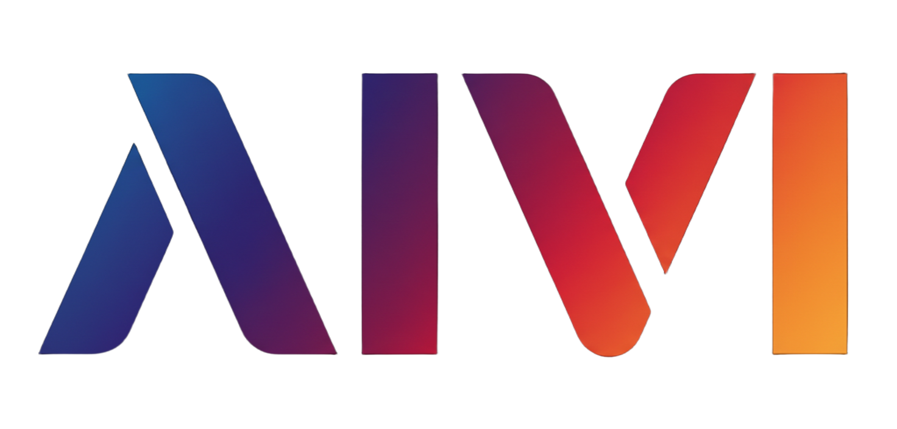

<p align="center">
  
</p>

<h1 align="center">Pure logic. Reactive state. Native desktop.</h1>

<p align="center">
  A functional language for building Linux applications with GTK 4 and libadwaita.<br />
  Implemented in Rust. Powered by Cranelift.
</p>

<p align="center">
  <a href="manual/guide/getting-started.md">Start here</a> ·
  <a href="manual/guide/your-first-app.md">Build your first app</a> ·
  <a href="manual/reference/index.md">Language reference</a> ·
  <a href="manual/stdlib/index.md">Standard library</a> ·
  <a href="CONTRIBUTING.md">Contribute</a>
</p>

---

AIVI makes dataflow part of the language. Describe your data with closed types, transform it
with pure functions, connect it to the outside world through typed sources, and bind the result
to native widgets.

There are no mutable variables, `if`/`else` statements, surface loops, or null values. Pattern
matching, collection combinators, and a first-class pipe algebra do the work. Signals describe
how state changes; the runtime propagates those changes to the UI.

> **Development status:** AIVI is pre-1.0 and evolving. The repository includes a working
> compiler, reactive runtime, GTK bridge, CLI, and editor tooling. Support varies by feature;
> the manual distinguishes executable behavior from declared or planned capabilities.

## A little AIVI

A source, a pure state transition, a derived signal, and a native window:

```aivi
type Unit -> Int -> Int
func countTicks = tick total =>
    total + 1

@source timer.every 1sec
signal tick : Signal Unit

signal ticks = tick
 +|> 0 countTicks

signal label = ticks
  |> "Ticks: {.}"

value main =
    <Window title="Hello, AIVI">
        <Label text={label} marginTop={24} marginBottom={24} marginStart={24} marginEnd={24} />
    </Window>

export main
```

`@source` brings timer events into the graph. `+|>` folds them into state. `|>` derives display
text, and `text={label}` binds that signal to the label. You declare the relationships once.

Save this as `hello.aivi`, then run `target/debug/aivi run hello.aivi` after building below.
The counter measures delivered ticks, not precise elapsed wall-clock time.

## Language highlights

| Feature | What it brings to your code |
| --- | --- |
| **Pure functions and immutable values** | Transform data without hidden mutation; describe effects with tasks and sources. |
| **Closed, statically checked types** | Records, tuples, tagged unions, generics, and explicit `Option`, `Result`, and `Validation` values. |
| **Exhaustive pattern matching** | Branch on the shape of data with `\|\|>`; use `T\|>` / `F\|>` for canonical two-way cases. |
| **Pipe algebra** | Compose transformations, filtering, fan-out, accumulation, validation, and applicative combinations. |
| **Structural patches** | Update immutable records and nested structures with `<\|`, including selector-based updates. |
| **Nominal domains** | Give carrier values a distinct identity, with domain members, operators, and suffix literals such as `1sec`. |
| **Typeclasses and higher kinds** | Share abstractions such as `Eq`, `Ord`, `Functor`, `Applicative`, `Monad`, and `Foldable` across supported types. |
| **First-class signals** | Derive, merge, and accumulate reactive values in an explicit dependency graph. |
| **Typed external decoding** | Declare the payload you expect at a source boundary and keep failures visible in its type. |
| **Modules and imports** | Organize reusable code with explicit exports, local aliases, and opt-in project-wide `hoist` declarations. |
| **Text interpolation and collection helpers** | Keep presentation and data transformations concise without adding an imperative statement layer. |

Explore [values and functions](manual/guide/values-and-functions.md),
[types](manual/guide/types.md), [pipes](manual/guide/pipes.md),
[domains](manual/guide/domains.md), and [higher-kinded support](manual/guide/typeclasses.md).

## Native by design

### GTK and libadwaita

Markup is an expression that describes real GTK widgets—not a browser-based UI or a virtual DOM.
Bind properties to signals and compose layouts, forms, lists, navigation, dialogs, and other
desktop controls with the [widget catalog](manual/guide/markup.md).

The runtime separates worker-side work from UI ownership: GTK creation, mutation, and event
dispatch stay on the main thread. Signal propagation is designed around batched, topologically
ordered, glitch-free scheduler ticks.

### Sources and desktop integration

The [source catalog](manual/guide/source-catalog.md) covers timers, keyboard input, HTTP and
OpenAPI-backed services, filesystem reads and watches, database-backed signals, environment and
process access, D-Bus, portals, notifications, settings, secrets, and mail-related integrations.

Capability handles group related operations behind an explicit boundary. Reactive observations
feed signals; one-shot work is represented by `Task E A`. Individual providers document their
supported arguments, options, and current limitations.

### Native compilation

The Rust implementation lowers programs through explicit compiler layers:

```text
Source → CST → HIR → Typed core → Closed typed lambda IR → Backend IR → Cranelift
```

Cranelift supplies native object generation and JIT execution. `compile` emits an object file;
`build` packages a runnable executable with a source-free application bundle. Packaged desktop
apps still require the target system's GTK stack. See
[toolchain and artifacts](manual/reference/toolchain-and-artifacts.md) for the exact contract.

## Try it

From a checkout of this repository, install Rust through rustup; `rust-toolchain.toml` selects
the project's pinned toolchain automatically. On Debian or Ubuntu, install the native headers:

```sh
sudo apt-get install libgtk-4-dev libadwaita-1-dev libwebkitgtk-6.0-dev \
  libssl-dev libdbus-1-dev libsecret-1-dev
```

Build the CLI and check the included Snake demo:

```sh
cargo build --bin aivi
target/debug/aivi check demos/snake.aivi
target/debug/aivi run demos/snake.aivi
```

Running a GTK app requires a graphical desktop session. For a guided introduction, follow
[Build a Small Task Tracker](manual/guide/your-first-app.md). For a larger example, explore
the [Snake walkthrough](manual/guide/building-snake.md) and [demo source](demos/snake.aivi).

## Tools that come with the language

| Tool | Purpose |
| --- | --- |
| `aivi check` | Parse, resolve, and type-check source. |
| `aivi run` | Launch a native GTK application. |
| `aivi execute` | Run a headless exported task entrypoint. |
| `aivi compile` / `aivi build` | Emit native object code or package a runnable application. |
| `aivi test` | Run `@test` values. |
| `aivi fmt` | Format source or check canonical formatting. |
| `aivi openapi-gen` | Generate AIVI declarations from OpenAPI schemas. |
| `aivi lsp` | Serve diagnostics, completion, hover, navigation, rename, formatting, and semantic tokens. |
| `aivi mcp` | Expose live application introspection, including signals, sources, GTK trees, and events. |
| `aivi manual-snippets` | Validate fenced AIVI documentation examples. |

Use `aivi help <command>` for command-specific options. The
[VS Code extension](tooling/packages/vscode-aivi/README.md) adds language-server integration,
syntax highlighting, snippets, check/test commands, and an AIVI editor theme. It uses your
installed compiler rather than bundling one.

Crusty serves a separate role: it is the repository's MCP-backed project ledger for contributor
decisions, constraints, findings, and work. See the
[contribution workflow](manual/how-to/contribute.md#connect-crusty) for setup.

## Explore the library

The [standard-library reference](manual/stdlib/index.md) groups modules for collections,
optional and fallible values, text, numeric operations, dates and durations, paths, bytes, JSON,
and desktop integration. Some modules provide callable helpers; others provide vocabulary and
handle types used by source capabilities.

Start with [lists](manual/stdlib/list.md), [options](manual/stdlib/option.md),
[results](manual/stdlib/result.md), [text](manual/stdlib/text.md), and
the [prelude](manual/stdlib/prelude.md).

## Know the boundaries

AIVI's design is broader than every currently executable path. In particular:

- Higher-kinded support has an explicit [carrier and instance boundary](manual/guide/typeclasses.md).
  `Signal` is deliberately not a monad; its dependency graph stays static.
- Provider and widget capabilities have [source-specific](manual/guide/source-catalog.md) and
  [widget-specific](manual/guide/markup.md) limits. A type declaration alone is not an implemented integration.
- Some library APIs are incomplete—for example, [time formatting and parsing](manual/stdlib/time.md)
  currently have restricted runtime behavior.
- Serialized compiler artifacts are versioned build outputs, not a stable interchange format.

## Learn more and contribute

| Your goal | Start here |
| --- | --- |
| Learn by building | [Tutorials](manual/tutorials/index.md) |
| Solve a specific problem | [How-to guides](manual/how-to/index.md) |
| Look up language behavior | [Reference](manual/reference/index.md) |
| Understand the design | [Explanation](manual/explanation/index.md) |
| Read the specification | [Language specification](AIVI_RFC.md) · [Syntax sheet](syntax.md) |
| Work on AIVI | [Contributing](CONTRIBUTING.md) · [Repository invariants](AGENTS.md) |

Contributions should keep semantics explicit, preserve compiler-layer boundaries, and accompany
changes with focused tests and documentation. The contribution guide explains the verification
gates and Crusty workflow.

## License

The Rust workspace declares **GPL-3.0-only** in [Cargo.toml](Cargo.toml).
