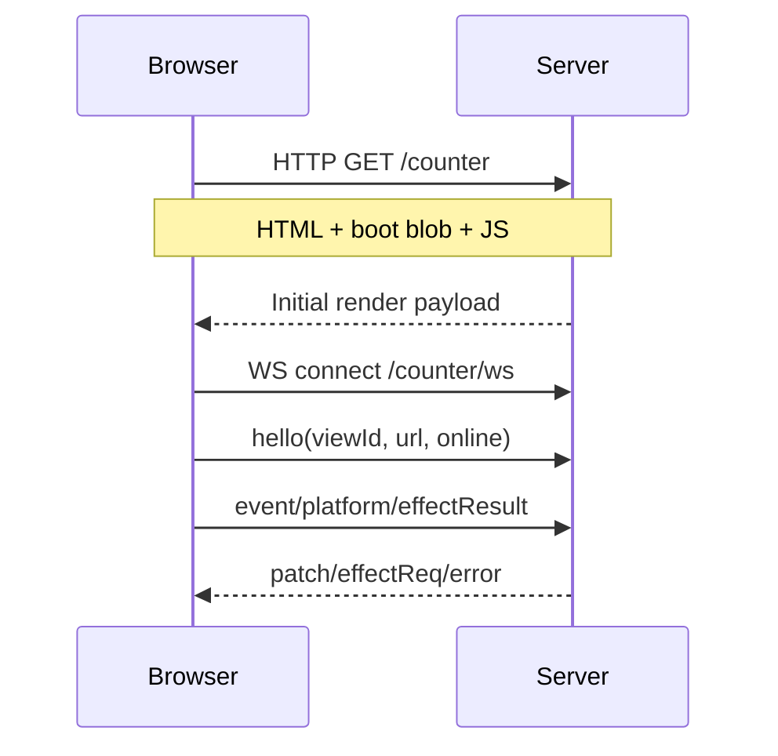

# `aivi.ui.ServerHtml`
## Server-Driven HTML · Typed Events · Route-Based Serving

<!-- quick-info: {"kind":"module","name":"aivi.ui.ServerHtml"} -->
`aivi.ui.ServerHtml` provides server-driven UI rendering for AIVI apps. The server
renders `VNode msg` trees to HTML, the browser forwards delegated events and platform
signals over WebSocket, and the server sends DOM patch operations back.

<!-- /quick-info -->
<div class="import-badge">use aivi.ui.ServerHtml</div>

`aivi.ui.ServerHtml` is the recommended v0.1 backend for interactive browser UIs.

## Architecture



## Public API

<<< ../../snippets/from_md/stdlib/ui/server_html/public_api.aivi{aivi}

## Example 1: Counter app with route-based server bootstrap

<<< ../../snippets/from_md/stdlib/ui/server_html/counter_app_route_bootstrap.aivi{aivi}

Notes:
- HTTP path is normalized (`/counter/` works).
- WebSocket path is derived as `/<route>/ws` (`/counter/ws` here).
- Unknown paths return `404`.

## Example 2: Platform + clipboard + intersection effects

<<< ../../snippets/from_md/stdlib/ui/server_html/platform_clipboard_intersection_effects.aivi{aivi}

## DOM event handlers and payloads

`aivi.ui.ServerHtml` supports delegated handlers encoded as `data-aivi-hid-*` attributes.

Supported event kinds on the wire:
- `click`, `input`
- `keydown`, `keyup`
- `pointerdown`, `pointerup`, `pointermove`
- `focus`, `blur`
- `transitionend`, `animationend`

`aivi.ui` attributes used with ServerHtml:
- `onClick` / `onClickE`
- `onInput` / `onInputE`
- `onKeyDown`, `onKeyUp`
- `onPointerDown`, `onPointerUp`, `onPointerMove`
- `onFocus`, `onBlur`
- `onTransitionEnd`, `onAnimationEnd`

## Runtime behavior details

- Each rendered element gets a stable `data-aivi-node` id.
- The client applies patch ops (`replace`, `setText`, `setAttr`, `removeAttr`) by node id.
- `serveHttp` allocates a fresh `viewId` and embeds it in the boot script.
- `serveWs` expects `hello` first; unknown `viewId` is rejected.
- `onPlatform` is optional via `Option msg`; return `None` to ignore a platform event.

## Wire protocol (JSON)

### Client → Server (`"t"` discriminator)

`hello`
```json
{ "t": "hello", "viewId": "<uuid>", "url": "https://example.com/counter", "online": true }
```

`event`
```json
{ "t": "event", "viewId": "<uuid>", "hid": 42, "kind": "click", "p": { "button": 0, "alt": false, "ctrl": false, "shift": false, "meta": false } }
```

`platform`
```json
{ "t": "platform", "viewId": "<uuid>", "kind": "visibility", "p": { "visibilityState": "hidden" } }
```

`effectResult`
```json
{ "t": "effectResult", "viewId": "<uuid>", "rid": 9001, "kind": "clipboard.readText", "ok": true, "p": { "text": "hello" } }
```

### Server → Client (`"t"` discriminator)

`patch`
```json
{ "t": "patch", "ops": "[{\"op\":\"setText\",\"id\":\"3\",\"text\":\"42\"}]" }
```

`subscribeIntersect`
```json
{ "t": "subscribeIntersect", "sid": 1, "options": { "rootMargin": "0px", "threshold": [0, 1] }, "targets": [{ "tid": 1, "nodeId": "hero" }] }
```

`effectReq`
```json
{ "t": "effectReq", "rid": 9001, "op": { "kind": "clipboard.writeText", "text": "copied" } }
```

`error`
```json
{ "t": "error", "code": "PAYLOAD", "detail": "invalid event payload" }
```

Error codes: `PROTO`, `DECODE`, `HID`, `PAYLOAD`, `PLATFORM`, `RID`.

## Client implementation and embedding

The browser client is built from `ui-client/` into one IIFE bundle
(`ui-client/dist/aivi-server-html-client.js`) and synced into runtime crates.

```bash
cd ui-client
pnpm install
pnpm build
node ./scripts/sync-to-rust.mjs
```

The sync copies the bundle to:
- `crates/aivi/src/runtime/builtins/ui/server_html_client.js`
- `crates/aivi_native_runtime/src/builtins/ui/server_html_client.js`

## v0.1 limits

- View state is socket-scoped; no reconnect state resume.
- Structural changes may emit subtree `replace` operations.
- Keyed reorders are represented as `replace` rather than a dedicated move op.
